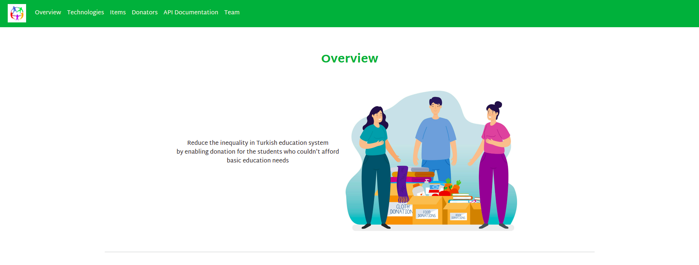

<div id="top"></div>


[![GitHub commit activity][commit-shield]][commit-url]
[![GitHub issues][issues-shield]][issues-url]
[![GitHub pull requests][pr-shield]][pr-url]
[![GitHub contributors][contributor-shield]][contributor-url]


<!-- PROJECT LOGO -->
<br />
<div align="center">
  <a href="https://github.com/RCDD-202110-TUR-BEW/backend-capstone-turkey-paying-it-forward">
    
  </a>

  <h3 align="center">Paying It Forward</h3>

  <p align="center">
    Reduce the inequality in Turkish education system <br />
    by enabling donation for the students who couldn't afford <br />
        basic education needs
    <br />
    <a href="#getting-started"><strong>Explore the docs »</strong></a>
    <br />
    <br />
    <a href="http://ec2-52-91-101-102.compute-1.amazonaws.com/">View Demo</a>
    ·
    <a href="https://github.com/RCDD-202110-TUR-BEW/backend-capstone-turkey-paying-it-forward/issues">Report Bug</a>
    ·
    <a href="https://github.com/RCDD-202110-TUR-BEW/backend-capstone-turkey-paying-it-forward/issues">Request Feature</a>
  </p>
</div>

<!-- TABLE OF CONTENTS -->
<details>
  <summary>Table of Contents</summary>
  <ol>
    <li>
      <a href="#about-the-project">About The Project</a>
      <ul>
      <li><a href="#features">Features</a></li>
        <li><a href="#built-with">Built With</a></li>
        <li><a href="#Screenshots">Screenshots</a></li>
      </ul>
    </li>
    <li>
      <a href="#getting-started">Getting Started</a>
      <ul>
        <li><a href="#prerequisites">Prerequisites</a></li>
        <li><a href="#installation">Installation</a></li>
      </ul>
    </li>
    <li><a href="#team">Team</a></li>
    <li><a href="#documentation">Documentation</a></li>
    <li><a href="#contributing">Contributing</a></li>
    <li><a href="#license">License</a></li>
    <li><a href="#acknowledgments">Acknowledgments</a></li>
  </ol>
</details>

<!-- ABOUT THE PROJECT -->

## About The Project

Paying it forward will help to reduce inequality in the education system in Turkey. In our current society, unfortunately some children or families couldn't afford basic needs such as books, stationery, etc. The platform aims to meet those needs via donation or enabling item sharing such as sending non-used books. The students also can request items they need and let the others know about this. The platform will also send a newsletter email to the registered users every week.


<p align="right">(<a href="#top">back to top</a>)</p>

## Features

- List items and users
- CRUD operations for items
- CRUD operations for users
- Rating users
- Filter items by their category
- Register/Login
  - Allow Google, Classic
- Newsletter subscription  
- Middleware for item owners

<p align="right">(<a href="#top">back to top</a>)</p>

### Built With

- [Node.js](https://nodejs.org/en/)
- [Express.js](https://expressjs.com/)
- [MongoDB](https://www.mongodb.com/)
- [Nodemailer](https://nodemailer.com/about/)
- [ESLint](https://eslint.org/)
- [Husky](https://github.com/typicode/husky)
- [AWS](https://aws.amazon.com/)
- [Swagger](https://swagger.io/)
- [Jest](https://jestjs.io/)

<p align="right">(<a href="#top">back to top</a>)</p> 


# Screenshots

### Database Design


### System Architecture Design


### Homepage



<!-- GETTING STARTED -->

## Getting Started

### Prerequisites


- yarn
  ```sh
  npm install --global yarn
  ```

### Installation

1. Clone the repo
   ```sh
   git clone https://github.com/RCDD-202110-TUR-BEW/backend-capstone-turkey-paying-it-forward.git
   ```
2. Navigate to the project folder
   ```sh
   cd backend-capstone-turkey-paying-it-forward
   ```

3. Install dependencies
   ```sh
   yarn
   ```
4. Run the project
   ```sh
   yarn start
   ```
5. Run checks and tests
   ```sh
   yarn test
   ```

<p align="right">(<a href="#top">back to top</a>)</p>

<!-- Documentation -->

## Website and Documentation

Check out our [website](http://ec2-52-91-101-102.compute-1.amazonaws.com). Explore our interactive API documentation [here](http://ec2-52-91-101-102.compute-1.amazonaws.com/api/docs/).

<p align="right">(<a href="#top">back to top</a>)</p>

## Team

[<br><sub>@mkkasem</sub>](https://github.com/mkkasem) | [<br><sub>@mehmetfatiherdem</sub>](https://github.com/mehmetfatiherdem) | [<br><sub>@AmmarBaki2</sub>](https://github.com/AmmarBaki2) | [<br><sub>@Peri7at</sub>](https://github.com/Peri7at) | [<br><sub>@Ammar-64</sub>](https://github.com/Ammar-64) | [<br><sub>@Shrreya</sub>](https://github.com/Shrreya) |
| :-----------------------------------------------------------------------------------------------------------------------------------------------------: | :-------------------------------------------------------------------------------------------------------------------------------------------------------------: | :------------------------------------------------------------------------------------------------------------------------------------------------------------: | :----------------------------------------------------------------------------------------------------------------------------------------------------------: | :----------------------------------------------------------------------------------------------------------------------------------------------------: | :------------------------------------------------------------------------------------------------------------------------------------------------------------------: |
<!-- ROADMAP -->
<!-- CONTRIBUTING -->
## Contributing
Contributions are what make the open source community such an amazing place to be learn, inspire, and create. Any contributions you make are **greatly appreciated**.
1. Fork the Project
2. Create your Feature Branch (`git checkout -b feature/AmazingFeature`)
3. Commit your Changes (`git commit -m 'Add some AmazingFeature'`)
4. Push to the Branch (`git push origin feature/AmazingFeature`)
5. Open a Pull Request
<!-- LICENSE -->
## License
Distributed under the MIT License. See `LICENSE` for more information.

<!-- ACKNOWLEDGEMENTS -->
## Acknowledgements
* [![google-shield]][google-url]
* [![stackoverflow-shield]][stackoverflow-url]
* [![MDN Web Docs]][mdn-url]
<!-- MARKDOWN LINKS & IMAGES -->
<!-- https://www.markdownguide.org/basic-syntax/#reference-style-links -->
[license-shield]: https://img.shields.io/github/license/RCDD-202110-TUR-BEW/backend-capstone-turkey-bursapediary.svg?style=flat-square
[license-url]: https://github.com/RCDD-202110-TUR-BEW/backend-capstone-turkey-bursapediary/blob/master/LICENSE
[freecodecamp-shield]: https://img.shields.io/badge/-freecodecamp-black?style=flat-square&logo=freecodecamp
[freecodecamp-url]: https://www.freecodecamp.org/
[google-shield]: https://img.shields.io/badge/google-4285F4?style=for-the-badge&logo=google&logoColor=white
[google-url]: https://www.google.com/
[stackoverflow-shield]: https://img.shields.io/badge/-stackoverflow-E34F26?style=for-the-badge&logo=stackoverflow&logoColor=white
[stackoverflow-url]: https://www.stackoverflow.com/
[html-shield]: https://img.shields.io/badge/-HTML5-E34F26?style=flat-square&logo=html5&logoColor=white
[html-url]: https://en.wikipedia.org/wiki/HTML
[css-shield]: https://img.shields.io/badge/-CSS3-1572B6?style=flat-square&logo=css3
[css-url]: https://en.wikipedia.org/wiki/CSS
[nodejs-shield]: https://img.shields.io/badge/-Nodejs-black?style=flat-square&logo=Node.js
[nodejs-url]: https://nodejs.org/en/
[react-shield]: https://img.shields.io/badge/-React-black?style=flat-square&logo=react
[react-url]: https://reactjs.org/
[mongodb-shield]: https://img.shields.io/badge/-MongoDB-black?style=flat-square&logo=mongodb
[mongodb-url]: https://www.mongodb.com/
[express-shield]: https://img.shields.io/badge/-express-black.svg?style=flat-square&logo=express
[express-url]: https://expressjs.com/
[graphql-shield]: https://img.shields.io/badge/-GraphQL-E10098?style=flat-square&logo=graphql
[graphql-url]: https://graphql.org/
[apollo-shield]: https://img.shields.io/badge/-Apollo%20GraphQL-311C87?style=flat-square&logo=apollo-graphql
[apollo-url]: https://www.apollographql.com/
[heroku-shield]: https://img.shields.io/badge/-Heroku-430098?style=flat-square&logo=heroku
[heroku-url]: https://dashboard.heroku.com/
[netlify-shield]: https://img.shields.io/badge/-netlify-black?style=flat-square&logo=netlify
[netlify-url]: https://www.netlify.com/
[git-shield]: https://img.shields.io/badge/-Git-black?style=flat-square&logo=git
[git-url]: https://git-scm.com/
[github-shield]: https://img.shields.io/badge/-GitHub-181717?style=flat-square&logo=github
[github-url]: https://github.com/
[linkedin-shield]: https://img.shields.io/badge/-linkedin-blue?style=flat-square&logo=Linkedin&logoColor=white
[linkedin-url]: https://linkedin.com/

<p align="right">(<a href="#top">back to top</a>)</p>

<!-- MARKDOWN LINKS & IMAGES -->
<!-- https://www.markdownguide.org/basic-syntax/#reference-style-links -->


[commit-shield]: https://img.shields.io/github/commit-activity/m/RCDD-202110-TUR-BEW/backend-capstone-turkey-paying-it-forward?color=%233fa037&style=for-the-badge
[commit-url]: https://github.com/RCDD-202110-TUR-BEW/backend-capstone-turkey-paying-it-forward/graphs/commit-activity
[issues-shield]: https://img.shields.io/github/issues-raw/RCDD-202110-TUR-BEW/backend-capstone-turkey-paying-it-forward?color=%233fa037&style=for-the-badge
[issues-url]: https://github.com/RCDD-202110-TUR-BEW/backend-capstone-turkey-paying-it-forward/issues
[pr-shield]: https://img.shields.io/github/issues-pr/RCDD-202110-TUR-BEW/backend-capstone-turkey-paying-it-forward?color=%233fa037&style=for-the-badge
[pr-url]: https://github.com/RCDD-202110-TUR-BEW/backend-capstone-turkey-paying-it-forward/pulls
[contributor-shield]: https://img.shields.io/github/contributors/RCDD-202110-TUR-BEW/backend-capstone-turkey-paying-it-forward?color=%233fa037&style=for-the-badge
[contributor-url]: https://github.com/RCDD-202110-TUR-BEW/backend-capstone-turkey-paying-it-forward/graphs/contributors
[stackoverflow-shield]: https://img.shields.io/badge/-stackoverflow-E34F26?style=for-the-badge&logo=stackoverflow&logoColor=white
[stackoverflow-url]: https://www.stackoverflow.com/
[MDN Web Docs]:https://img.shields.io/badge/MDN_Web_Docs-black?style=for-the-badge&logo=mdnwebdocs&logoColor=white
[mdn-url]: https://developer.mozilla.org/en-US/
[NPM]: https://img.shields.io/badge/NPM-%23000000.svg?style=for-the-badge&logo=npm&logoColor=white
[npm-url]: https://www.npmjs.com/